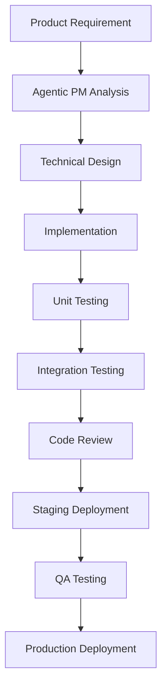

# Development Workflow & Implementation Strategy
# Enterprise 2.0 Agent-to-Agent & Agent-to-Human Messaging Platform

**Document Version:** 1.0  
**Date:** September 14, 2025  
**Generated by:** Agentic PM Framework  
**Companion to:** Enterprise-Agent-Messaging-Platform-PRD.md

---

## Executive Summary

This document outlines the complete development workflow and implementation strategy for building the Enterprise 2.0 Agent-to-Agent & Agent-to-Human Messaging Platform. It leverages the existing Agentic PM framework capabilities and provides a systematic approach to product development, from initial planning through deployment and scaling.

**Key Objectives:**
- Utilize existing Agentic PM framework for rapid prototyping and validation
- Establish robust development processes for enterprise-grade software
- Create systematic approach to feature development and testing
- Ensure scalable architecture from day one

---

## Phase 1: Foundation & Setup (Months 1-2)

### 1.1 Project Initialization

#### Using Agentic PM for Initial Analysis
```bash
# Initialize the Agentic PM system for comprehensive analysis
cd pm-agent
npm install
npm run demo

# Generate comprehensive analysis for the messaging platform concept
```

**Agentic PM Workflow Steps:**
1. **Market Research Agent:** Analyze competitive landscape and market positioning
2. **Document Package Agent:** Generate detailed technical specifications
3. **Prototype Generator Agent:** Create initial system architecture prototypes
4. **Evaluation Agent:** Assess technical feasibility and business viability

#### Repository Setup
```bash
# Create main repository structure
mkdir enterprise-agent-messaging-platform
cd enterprise-agent-messaging-platform

# Initialize git repository
git init
git remote add origin [repository-url]

# Create initial project structure
mkdir -p {backend,frontend,mobile,docs,infrastructure,tests}
mkdir -p backend/{api,services,agents,workflows,security}
mkdir -p frontend/{web,components,hooks,utils}
mkdir -p infrastructure/{docker,kubernetes,terraform}
```

#### Development Environment Setup
```yaml
# docker-compose.dev.yml
version: '3.8'
services:
  postgres:
    image: postgres:15
    environment:
      POSTGRES_DB: agent_messaging
      POSTGRES_USER: dev
      POSTGRES_PASSWORD: dev
    ports:
      - "5432:5432"
  
  mongodb:
    image: mongo:7
    ports:
      - "27017:27017"
  
  redis:
    image: redis:7-alpine
    ports:
      - "6379:6379"
  
  kafka:
    image: confluentinc/cp-kafka:latest
    environment:
      KAFKA_ZOOKEEPER_CONNECT: zookeeper:2181
      KAFKA_ADVERTISED_LISTENERS: PLAINTEXT://localhost:9092
    ports:
      - "9092:9092"
```

### 1.2 Architecture Foundation

#### Core Technology Stack Implementation
```typescript
// backend/src/config/database.ts
import { Pool } from 'pg';
import { MongoClient } from 'mongodb';
import Redis from 'redis';

export class DatabaseManager {
  private pgPool: Pool;
  private mongoClient: MongoClient;
  private redisClient: Redis;

  async initialize() {
    // PostgreSQL for transactional data
    this.pgPool = new Pool({
      host: process.env.POSTGRES_HOST,
      port: parseInt(process.env.POSTGRES_PORT || '5432'),
      database: process.env.POSTGRES_DB,
      user: process.env.POSTGRES_USER,
      password: process.env.POSTGRES_PASSWORD,
    });

    // MongoDB for message storage
    this.mongoClient = new MongoClient(process.env.MONGODB_URI || 'mongodb://localhost:27017');
    await this.mongoClient.connect();

    // Redis for caching and sessions
    this.redisClient = Redis.createClient({
      url: process.env.REDIS_URL || 'redis://localhost:6379'
    });
    await this.redisClient.connect();
  }
}
```

#### Agent Communication Framework
```typescript
// backend/src/agents/AgentRegistry.ts
export interface AgentCapability {
  id: string;
  name: string;
  description: string;
  inputSchema: any;
  outputSchema: any;
}

export interface RegisteredAgent {
  id: string;
  name: string;
  endpoint: string;
  capabilities: AgentCapability[];
  authentication: {
    type: 'bearer' | 'api_key' | 'oauth2';
    credentials: any;
  };
  status: 'active' | 'inactive' | 'error';
  lastHeartbeat: Date;
}

export class AgentRegistry {
  private agents: Map<string, RegisteredAgent> = new Map();

  async registerAgent(agent: RegisteredAgent): Promise<void> {
    // Validate agent capabilities
    await this.validateAgentEndpoint(agent);
    
    // Store in registry
    this.agents.set(agent.id, agent);
    
    // Start health monitoring
    this.startHealthMonitoring(agent.id);
  }

  async discoverCapableAgents(requiredCapability: string): Promise<RegisteredAgent[]> {
    return Array.from(this.agents.values())
      .filter(agent => 
        agent.status === 'active' &&
        agent.capabilities.some(cap => cap.name === requiredCapability)
      );
  }
}
```

### 1.3 Development Process Setup

#### Git Workflow Strategy
```bash
# Branch naming convention
feature/[ticket-id]-[short-description]
bugfix/[ticket-id]-[short-description]
hotfix/[ticket-id]-[short-description]
release/[version-number]

# Example workflow
git checkout -b feature/AMP-001-agent-registry
# Development work
git add .
git commit -m "AMP-001: Implement basic agent registry functionality"
git push origin feature/AMP-001-agent-registry
# Create pull request
```

#### CI/CD Pipeline Configuration
```yaml
# .github/workflows/main.yml
name: CI/CD Pipeline

on:
  push:
    branches: [ main, develop ]
  pull_request:
    branches: [ main ]

jobs:
  test:
    runs-on: ubuntu-latest
    
    services:
      postgres:
        image: postgres:15
        env:
          POSTGRES_PASSWORD: test
        options: >-
          --health-cmd pg_isready
          --health-interval 10s
          --health-timeout 5s
          --health-retries 5

    steps:
    - uses: actions/checkout@v3
    
    - name: Setup Node.js
      uses: actions/setup-node@v3
      with:
        node-version: '18'
        cache: 'npm'
    
    - name: Install dependencies
      run: |
        cd backend && npm ci
        cd ../frontend && npm ci
    
    - name: Run tests
      run: |
        cd backend && npm test
        cd ../frontend && npm test
    
    - name: Build application
      run: |
        cd backend && npm run build
        cd ../frontend && npm run build

  deploy-staging:
    needs: test
    runs-on: ubuntu-latest
    if: github.ref == 'refs/heads/develop'
    
    steps:
    - name: Deploy to staging
      run: |
        # Deploy to staging environment
        echo "Deploying to staging..."
```

---

## Phase 2: MVP Development (Months 3-6)

### 2.1 Core Feature Development Workflow

#### Feature Development Process


#### Using Agentic PM for Feature Planning
```typescript
// Example: Using Agentic PM to analyze a new feature
import { AgenticPM } from '../pm-agent/src/index';

async function analyzeFeature(featureDescription: string) {
  const agentic = new AgenticPM({
    enableOrchestration: true,
    enableMetrics: true,
    enableEvaluation: true,
    costBudget: 0.30,
    latencyTarget: 45000
  });

  const analysis = await agentic.comprehensiveAnalysis({
    title: "Agent-to-Agent Secure Messaging",
    description: featureDescription,
    targetMarket: "Enterprise AI Operations Teams",
    keyFeatures: [
      "End-to-end encryption",
      "Message routing",
      "Authentication",
      "Audit logging"
    ],
    goals: [
      "Secure agent communication",
      "High throughput messaging",
      "Compliance ready"
    ]
  });

  return analysis;
}
```

### 2.2 Sprint Planning & Execution

#### Sprint Structure (2-week sprints)
```
Sprint Planning (Day 1):
├── Product Backlog Refinement
├── Agentic PM Feature Analysis
├── Technical Design Review
├── Sprint Goal Definition
└── Task Estimation & Assignment

Sprint Execution (Days 2-9):
├── Daily Standups
├── Development Work
├── Code Reviews
├── Continuous Integration
└── Stakeholder Updates

Sprint Review & Retrospective (Day 10):
├── Demo to Stakeholders
├── Metrics Review (via Agentic PM)
├── Retrospective
└── Next Sprint Planning
```

#### Development Metrics Tracking
```typescript
// Using Agentic PM MetricsCollector for development metrics
import { MetricsCollector, BUSINESS_METRICS } from '../pm-agent/src/metrics/MetricsCollector';

const metricsCollector = new MetricsCollector({
  collectionInterval: 300000, // 5 minutes
  autoReporting: true,
  dashboardEnabled: true
});

// Track development metrics
metricsCollector.recordMetric({
  name: 'feature_development_velocity',
  value: completedStoryPoints,
  tags: { sprint: sprintNumber, team: teamName }
});

metricsCollector.recordMetric({
  name: 'code_quality_score',
  value: codeQualityScore,
  tags: { component: componentName }
});
```

### 2.3 Core Features Implementation

#### 1. Agent Registry Implementation
```typescript
// backend/src/services/AgentRegistryService.ts
export class AgentRegistryService {
  constructor(
    private db: DatabaseManager,
    private metricsCollector: MetricsCollector
  ) {}

  async registerAgent(agentData: RegisteredAgent): Promise<string> {
    const startTime = Date.now();
    
    try {
      // Validate agent
      await this.validateAgent(agentData);
      
      // Store in database
      const agentId = await this.db.agents.create(agentData);
      
      // Start monitoring
      await this.startAgentMonitoring(agentId);
      
      // Record metrics
      this.metricsCollector.recordMetric({
        name: 'agent_registration_success',
        value: 1,
        tags: { agentType: agentData.type }
      });
      
      return agentId;
    } catch (error) {
      this.metricsCollector.recordMetric({
        name: 'agent_registration_error',
        value: 1,
        tags: { error: error.message }
      });
      throw error;
    } finally {
      const duration = Date.now() - startTime;
      this.metricsCollector.recordMetric({
        name: 'agent_registration_duration',
        value: duration
      });
    }
  }
}
```

#### 2. Message Routing System
```typescript
// backend/src/services/MessageRoutingService.ts
export class MessageRoutingService {
  async routeMessage(message: AgentMessage): Promise<void> {
    // Determine target agents based on message content and routing rules
    const targetAgents = await this.determineTargetAgents(message);
    
    // Route message to each target agent
    const routingPromises = targetAgents.map(agent => 
      this.deliverMessage(agent, message)
    );
    
    await Promise.all(routingPromises);
  }

  private async determineTargetAgents(message: AgentMessage): Promise<RegisteredAgent[]> {
    // Use AI-powered routing logic
    const routingAnalysis = await this.aiRoutingService.analyzeMessage(message);
    
    // Find agents with matching capabilities
    return await this.agentRegistry.findAgentsByCapabilities(
      routingAnalysis.requiredCapabilities
    );
  }
}
```

#### 3. Security Framework
```typescript
// backend/src/security/SecurityService.ts
export class SecurityService {
  async authenticateAgent(agentId: string, credentials: any): Promise<boolean> {
    // Validate agent credentials
    const agent = await this.agentRegistry.getAgent(agentId);
    if (!agent) return false;

    // Verify credentials based on authentication type
    switch (agent.authentication.type) {
      case 'bearer':
        return this.verifyBearerToken(credentials.token, agent);
      case 'api_key':
        return this.verifyApiKey(credentials.apiKey, agent);
      case 'oauth2':
        return this.verifyOAuth2Token(credentials.token, agent);
      default:
        return false;
    }
  }

  async encryptMessage(message: any, recipientAgentId: string): Promise<EncryptedMessage> {
    const recipientPublicKey = await this.getAgentPublicKey(recipientAgentId);
    const encryptedContent = await this.encrypt(message, recipientPublicKey);
    
    return {
      encryptedContent,
      signature: await this.signMessage(encryptedContent),
      timestamp: new Date().toISOString()
    };
  }
}
```

---

## Phase 3: Testing & Quality Assurance

### 3.1 Testing Strategy

#### Test Pyramid Structure
```
                    E2E Tests (5%)
                 ├─────────────────┤
              Integration Tests (15%)
           ├─────────────────────────┤
         Unit Tests (80%)
    ├─────────────────────────────────┤
```

#### Automated Testing Framework
```typescript
// tests/integration/AgentCommunication.test.ts
import { AgenticPM } from '../../pm-agent/src/index';
import { TestAgent } from '../utils/TestAgent';

describe('Agent Communication Integration Tests', () => {
  let agenticPM: AgenticPM;
  let testAgent1: TestAgent;
  let testAgent2: TestAgent;

  beforeAll(async () => {
    agenticPM = new AgenticPM();
    testAgent1 = new TestAgent('test-agent-1');
    testAgent2 = new TestAgent('test-agent-2');
    
    await agenticPM.registerAgent(testAgent1);
    await agenticPM.registerAgent(testAgent2);
  });

  test('should route messages between agents', async () => {
    const message = {
      from: 'test-agent-1',
      to: 'test-agent-2',
      content: { action: 'process_data', data: { id: 1 } }
    };

    const result = await agenticPM.sendMessage(message);
    expect(result.status).toBe('delivered');
    expect(result.deliveryTime).toBeLessThan(1000);
  });

  test('should handle agent authentication', async () => {
    const authResult = await agenticPM.authenticateAgent(
      'test-agent-1',
      { token: 'valid-token' }
    );
    expect(authResult).toBe(true);
  });
});
```

#### Performance Testing
```typescript
// tests/performance/LoadTest.ts
import { performance } from 'perf_hooks';

describe('Performance Tests', () => {
  test('should handle 1000 concurrent agent messages', async () => {
    const startTime = performance.now();
    
    const messagePromises = Array.from({ length: 1000 }, (_, i) => 
      agenticPM.sendMessage({
        from: `agent-${i % 10}`,
        to: `agent-${(i + 1) % 10}`,
        content: { message: `Test message ${i}` }
      })
    );

    const results = await Promise.all(messagePromises);
    const endTime = performance.now();
    
    const successCount = results.filter(r => r.status === 'delivered').length;
    const totalTime = endTime - startTime;
    
    expect(successCount).toBe(1000);
    expect(totalTime).toBeLessThan(5000); // 5 seconds
    expect(totalTime / 1000).toBeLessThan(5); // 5ms per message average
  });
});
```

### 3.2 Quality Gates

#### Code Quality Metrics
```yaml
# sonarqube-project.properties
sonar.projectKey=enterprise-agent-messaging
sonar.projectName=Enterprise Agent Messaging Platform
sonar.projectVersion=1.0

# Quality gates
sonar.qualitygate.wait=true
sonar.coverage.exclusions=**/*.test.ts,**/node_modules/**
sonar.typescript.lcov.reportPaths=coverage/lcov.info

# Thresholds
sonar.coverage.minimum=80%
sonar.duplicated_lines_density.maximum=3%
sonar.maintainability_rating.minimum=A
sonar.reliability_rating.minimum=A
sonar.security_rating.minimum=A
```

#### Automated Security Scanning
```yaml
# .github/workflows/security.yml
name: Security Scan

on:
  push:
    branches: [ main, develop ]
  pull_request:
    branches: [ main ]

jobs:
  security:
    runs-on: ubuntu-latest
    
    steps:
    - uses: actions/checkout@v3
    
    - name: Run Snyk to check for vulnerabilities
      uses: snyk/actions/node@master
      env:
        SNYK_TOKEN: ${{ secrets.SNYK_TOKEN }}
      with:
        args: --severity-threshold=high
    
    - name: Run CodeQL Analysis
      uses: github/codeql-action/init@v2
      with:
        languages: typescript, javascript
    
    - name: Perform CodeQL Analysis
      uses: github/codeql-action/analyze@v2
```

---

## Phase 4: Deployment & Infrastructure

### 4.1 Infrastructure as Code

#### Kubernetes Deployment
```yaml
# infrastructure/kubernetes/deployment.yml
apiVersion: apps/v1
kind: Deployment
metadata:
  name: agent-messaging-api
  namespace: production
spec:
  replicas: 3
  selector:
    matchLabels:
      app: agent-messaging-api
  template:
    metadata:
      labels:
        app: agent-messaging-api
    spec:
      containers:
      - name: api
        image: agent-messaging/api:latest
        ports:
        - containerPort: 3000
        env:
        - name: NODE_ENV
          value: "production"
        - name: DATABASE_URL
          valueFrom:
            secretKeyRef:
              name: database-secret
              key: url
        resources:
          requests:
            memory: "256Mi"
            cpu: "250m"
          limits:
            memory: "512Mi"
            cpu: "500m"
        livenessProbe:
          httpGet:
            path: /health
            port: 3000
          initialDelaySeconds: 30
          periodSeconds: 10
        readinessProbe:
          httpGet:
            path: /ready
            port: 3000
          initialDelaySeconds: 5
          periodSeconds: 5
```

#### Terraform Infrastructure
```hcl
# infrastructure/terraform/main.tf
provider "aws" {
  region = var.aws_region
}

resource "aws_eks_cluster" "agent_messaging_cluster" {
  name     = "agent-messaging-${var.environment}"
  role_arn = aws_iam_role.cluster_role.arn
  version  = "1.27"

  vpc_config {
    subnet_ids = aws_subnet.cluster_subnets[*].id
    
    endpoint_config {
      private_access = true
      public_access  = true
    }
  }

  depends_on = [
    aws_iam_role_policy_attachment.cluster_AmazonEKSClusterPolicy,
  ]
}

resource "aws_rds_instance" "postgres" {
  identifier             = "agent-messaging-${var.environment}"
  allocated_storage      = 100
  storage_type          = "gp2"
  engine                = "postgres"
  engine_version        = "15.3"
  instance_class        = "db.t3.medium"
  db_name               = "agent_messaging"
  username              = var.db_username
  password              = var.db_password
  vpc_security_group_ids = [aws_security_group.rds.id]
  db_subnet_group_name  = aws_db_subnet_group.default.name
  
  backup_retention_period = 7
  backup_window          = "03:00-04:00"
  maintenance_window     = "sun:04:00-sun:05:00"
  
  skip_final_snapshot = false
  final_snapshot_identifier = "agent-messaging-final-snapshot-${formatdate("YYYY-MM-DD-hhmm", timestamp())}"
  
  tags = {
    Name        = "agent-messaging-${var.environment}"
    Environment = var.environment
  }
}
```

### 4.2 Monitoring & Observability

#### Application Monitoring
```typescript
// backend/src/monitoring/MonitoringService.ts
import { MetricsCollector } from '../../pm-agent/src/metrics/MetricsCollector';
import { Logger } from '../../pm-agent/src/utils/errorHandling';

export class MonitoringService {
  private metricsCollector: MetricsCollector;
  private logger: Logger;

  constructor() {
    this.metricsCollector = new MetricsCollector({
      collectionInterval: 60000,
      autoReporting: true,
      dashboardEnabled: true
    });
    
    this.logger = new Logger('MonitoringService');
  }

  async trackAgentPerformance(agentId: string, operation: string, duration: number) {
    this.metricsCollector.recordMetric({
      name: 'agent_operation_duration',
      value: duration,
      tags: { agentId, operation }
    });

    if (duration > 5000) { // Alert if operation takes more than 5 seconds
      this.logger.warn(`Slow agent operation detected`, {
        agentId,
        operation,
        duration
      });
    }
  }

  async trackMessageThroughput(messageCount: number) {
    this.metricsCollector.recordMetric({
      name: 'message_throughput',
      value: messageCount,
      tags: { timestamp: new Date().toISOString() }
    });
  }

  async generateHealthReport() {
    const metrics = await this.metricsCollector.getMetrics([
      'agent_operation_duration',
      'message_throughput',
      'error_rate',
      'system_resource_usage'
    ]);

    return {
      status: this.calculateOverallHealth(metrics),
      metrics,
      alerts: this.generateAlerts(metrics),
      recommendations: this.generateRecommendations(metrics)
    };
  }
}
```

#### Prometheus & Grafana Configuration
```yaml
# monitoring/prometheus/config.yml
global:
  scrape_interval: 15s
  evaluation_interval: 15s

rule_files:
  - "alert_rules.yml"

scrape_configs:
  - job_name: 'agent-messaging-api'
    static_configs:
      - targets: ['agent-messaging-api:3000']
    metrics_path: '/metrics'
    scrape_interval: 30s

  - job_name: 'agent-messaging-agents'
    static_configs:
      - targets: ['agent-registry:8080']
    metrics_path: '/agent-metrics'
    scrape_interval: 60s

alerting:
  alertmanagers:
    - static_configs:
        - targets:
          - alertmanager:9093
```

---

## Phase 5: Scaling & Optimization

### 5.1 Performance Optimization

#### Database Optimization Strategy
```sql
-- Database indexes for optimal performance
CREATE INDEX CONCURRENTLY idx_messages_timestamp 
ON messages (created_at DESC);

CREATE INDEX CONCURRENTLY idx_messages_agent_id 
ON messages (from_agent_id, to_agent_id);

CREATE INDEX CONCURRENTLY idx_agents_status 
ON agents (status) WHERE status = 'active';

-- Partitioning for message tables
CREATE TABLE messages_2025_09 PARTITION OF messages 
FOR VALUES FROM ('2025-09-01') TO ('2025-10-01');

-- Materialized views for analytics
CREATE MATERIALIZED VIEW agent_performance_summary AS
SELECT 
    agent_id,
    COUNT(*) as message_count,
    AVG(processing_time) as avg_processing_time,
    MAX(processing_time) as max_processing_time
FROM messages 
WHERE created_at >= NOW() - INTERVAL '24 hours'
GROUP BY agent_id;
```

#### Caching Strategy
```typescript
// backend/src/cache/CacheService.ts
export class CacheService {
  private redis: Redis;
  private localCache: Map<string, any> = new Map();

  async getAgentCapabilities(agentId: string): Promise<AgentCapability[]> {
    const cacheKey = `agent:capabilities:${agentId}`;
    
    // Try local cache first (fastest)
    if (this.localCache.has(cacheKey)) {
      return this.localCache.get(cacheKey);
    }
    
    // Try Redis cache (fast)
    const cached = await this.redis.get(cacheKey);
    if (cached) {
      const capabilities = JSON.parse(cached);
      this.localCache.set(cacheKey, capabilities);
      return capabilities;
    }
    
    // Fallback to database (slower)
    const capabilities = await this.db.getAgentCapabilities(agentId);
    
    // Cache for future requests
    await this.redis.setex(cacheKey, 300, JSON.stringify(capabilities)); // 5 minutes
    this.localCache.set(cacheKey, capabilities);
    
    return capabilities;
  }
}
```

### 5.2 Auto-scaling Configuration

#### Horizontal Pod Autoscaler
```yaml
# infrastructure/kubernetes/hpa.yml
apiVersion: autoscaling/v2
kind: HorizontalPodAutoscaler
metadata:
  name: agent-messaging-api-hpa
  namespace: production
spec:
  scaleTargetRef:
    apiVersion: apps/v1
    kind: Deployment
    name: agent-messaging-api
  minReplicas: 3
  maxReplicas: 20
  metrics:
  - type: Resource
    resource:
      name: cpu
      target:
        type: Utilization
        averageUtilization: 70
  - type: Resource
    resource:
      name: memory
      target:
        type: Utilization
        averageUtilization: 80
  - type: Pods
    pods:
      metric:
        name: messages_per_second
      target:
        type: AverageValue
        averageValue: "1000"
  behavior:
    scaleUp:
      stabilizationWindowSeconds: 60
      policies:
      - type: Percent
        value: 100
        periodSeconds: 15
    scaleDown:
      stabilizationWindowSeconds: 300
      policies:
      - type: Percent
        value: 10
        periodSeconds: 60
```

---

## Phase 6: Continuous Improvement

### 6.1 Feedback Loop Integration

#### Using Agentic PM for Continuous Analysis
```typescript
// backend/src/analytics/ContinuousImprovementService.ts
import { AgenticPM } from '../../pm-agent/src/index';

export class ContinuousImprovementService {
  private agenticPM: AgenticPM;

  constructor() {
    this.agenticPM = new AgenticPM({
      enableOrchestration: true,
      enableMetrics: true,
      enableEvaluation: true,
      costBudget: 0.50,
      latencyTarget: 30000
    });
  }

  async analyzeUserFeedback(feedbackData: UserFeedback[]): Promise<ImprovementRecommendations> {
    const analysisPrompt = `
      Analyze the following user feedback for our enterprise agent messaging platform:
      ${JSON.stringify(feedbackData, null, 2)}
      
      Provide recommendations for:
      1. Feature improvements
      2. Performance optimizations
      3. User experience enhancements
      4. Technical debt priorities
    `;

    const analysis = await this.agenticPM.comprehensiveAnalysisWithPrompt(analysisPrompt);
    
    return {
      recommendations: analysis.recommendations,
      priorityActions: analysis.priorityActions,
      impactAssessment: analysis.impactAssessment,
      implementationTimeline: analysis.timeline
    };
  }

  async performPerformanceAnalysis(): Promise<PerformanceInsights> {
    const metrics = await this.gatherPerformanceMetrics();
    
    const analysis = await this.agenticPM.quickAnalysis({
      title: "Performance Analysis",
      description: `Current system performance metrics: ${JSON.stringify(metrics)}`,
      targetMarket: "Internal optimization",
      keyFeatures: ["Performance monitoring", "Optimization recommendations"]
    });

    return analysis;
  }
}
```

### 6.2 A/B Testing Framework

#### Feature Flag Implementation
```typescript
// backend/src/features/FeatureFlagService.ts
export class FeatureFlagService {
  async isFeatureEnabled(featureKey: string, context: UserContext): Promise<boolean> {
    const flag = await this.getFeatureFlag(featureKey);
    if (!flag || !flag.enabled) return false;

    // Evaluate targeting rules
    if (flag.targetingRules) {
      return this.evaluateTargetingRules(flag.targetingRules, context);
    }

    // Simple percentage rollout
    return this.isInPercentage(context.userId, flag.rolloutPercentage);
  }

  async trackFeatureUsage(featureKey: string, userId: string, outcome: string) {
    await this.metricsCollector.recordMetric({
      name: 'feature_usage',
      value: 1,
      tags: { 
        feature: featureKey, 
        userId, 
        outcome 
      }
    });
  }
}
```

---

## Implementation Timeline & Milestones

### Month 1-2: Foundation
- ✅ Project setup and repository structure
- ✅ Development environment configuration
- ✅ CI/CD pipeline setup
- ✅ Basic architecture implementation
- ✅ Agentic PM integration for analysis

### Month 3-4: Core Features
- 🔄 Agent registry implementation
- 🔄 Basic messaging infrastructure
- 🔄 Authentication and security framework
- 🔄 Database schema and API endpoints
- 🔄 Unit and integration testing

### Month 5-6: Advanced Features
- 📅 Workflow orchestration
- 📅 Advanced security features
- 📅 Performance optimization
- 📅 Monitoring and observability
- 📅 Beta testing with design partners

### Month 7-8: Production Readiness
- 📅 Infrastructure deployment
- 📅 Load testing and optimization
- 📅 Security auditing
- 📅 Documentation completion
- 📅 Production deployment

### Month 9-12: Scale & Iterate
- 📅 Feature enhancements based on feedback
- 📅 Performance scaling
- 📅 Additional integrations
- 📅 Market expansion
- 📅 Continuous improvement implementation

---

## Risk Mitigation Strategies

### Technical Risks

#### 1. Scalability Issues
- **Mitigation:** 
  - Implement horizontal scaling from day one
  - Use load testing throughout development
  - Monitor performance metrics continuously
  - Plan for database sharding and caching

#### 2. Security Vulnerabilities
- **Mitigation:**
  - Security-first development approach
  - Regular security audits and penetration testing
  - Automated security scanning in CI/CD
  - Compliance framework implementation

#### 3. Integration Complexity
- **Mitigation:**
  - Standardized API design
  - Comprehensive testing of integrations
  - Fallback mechanisms for failed integrations
  - Partner ecosystem development

### Process Risks

#### 1. Development Velocity
- **Mitigation:**
  - Agile development methodology
  - Continuous integration and deployment
  - Regular sprint reviews and adjustments
  - Team capacity monitoring

#### 2. Quality Issues
- **Mitigation:**
  - Comprehensive testing strategy
  - Code review processes
  - Quality gates in CI/CD
  - Customer feedback integration

---

## Success Metrics & KPIs

### Development Metrics
- **Code Quality Score:** Target >90%
- **Test Coverage:** Target >85%
- **Build Success Rate:** Target >95%
- **Deployment Frequency:** Target daily to staging
- **Lead Time:** Target <2 days from commit to production

### Product Metrics
- **Feature Adoption Rate:** Target >70% within 30 days
- **User Engagement:** Target >80% DAU/MAU ratio
- **Performance:** Target <100ms API response time
- **Reliability:** Target 99.9% uptime
- **Customer Satisfaction:** Target >4.5/5 rating

### Business Metrics
- **Time to Market:** Target 6 months to MVP
- **Customer Acquisition:** Target 10 design partners for beta
- **Revenue:** Target $100K ARR by month 12
- **Market Position:** Target top 3 in agent communication category

---

## Conclusion

This comprehensive development workflow and implementation strategy provides a systematic approach to building the Enterprise 2.0 Agent-to-Agent & Agent-to-Human Messaging Platform. By leveraging the existing Agentic PM framework, we can accelerate development while maintaining high quality and enterprise-grade standards.

**Key Success Factors:**
1. **Systematic Approach:** Well-defined processes and workflows
2. **Quality Focus:** Comprehensive testing and monitoring
3. **Scalability Planning:** Architecture designed for growth
4. **Continuous Improvement:** Feedback loops and optimization
5. **Risk Management:** Proactive risk identification and mitigation

**Next Steps:**
1. Execute Phase 1 foundation setup
2. Begin MVP development with design partners
3. Implement continuous feedback loops
4. Scale development team as needed
5. Prepare for market launch

This workflow ensures we can deliver a world-class product that meets the demanding requirements of enterprise customers while maintaining development velocity and quality standards.

---

**Document Control:**
- **Last Updated:** September 14, 2025
- **Next Review:** October 14, 2025
- **Owner:** Engineering Team
- **Approvers:** CTO, Head of Engineering, Head of Product